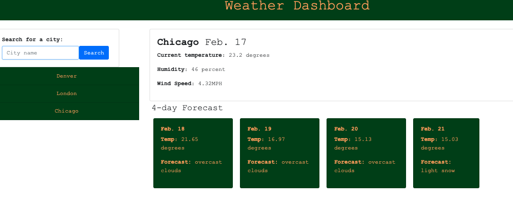

# Weather Dashboard

This web application offers a weather dashboard that allows a user to search for current weather and forecast information for any city in the world.

## Installation/Usage

To view the website simply load https://nmiller2379.github.io/weather-dashboard/ in your browers.

## Functionality

Upon load, the page renders a series of cards as well as a search field. Once the user types a city into the search field and clicks the search button, the page is dynamically updated to display the weather information the user requested.

## Technologies

The application uses two calls to the openweathermap.org API to grab the weather information — both current and forecast — that the user searches for. The application also uses bootstrap, daysjs and jquery as well as HTML, CSS and JS.

## Challenges

I was unable to get the local storage component to work to save the users searches. Nor was I able to use the API to get the weather icons.
